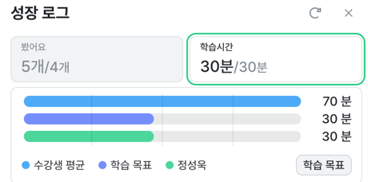

# 2023년 9월 2일 공부 기록

[절대경로와 상대경로](../../../기타/절대경로와_상대경로.md)

[백준 2805(파라메트릭 서치) 실2 나무 자르기](../../../Algorithm/SolvedProblem/파라메트릭서치/2805/2805.md)

[백준 1654(파라메트릭 서치) 실2 랜선 자르기](../../../Algorithm/SolvedProblem/파라메트릭서치/1654/1654.md)

[백준 2512(파라메트릭 서치) 실2 예산](../../../Algorithm/SolvedProblem/파라메트릭서치/2512/2512.md)

[백준 2110(파라메트릭 서치) 골4 공유기 설치](../../../Algorithm/SolvedProblem/파라메트릭서치/2110/2110.md)

### [우테코 6기 준비](../../../우아한테크코스/우테코_6기_준비/우테코_6기_준비.md)

[이유와 솔루션으로 정리하는 객체지향 생활체조 원칙](../../../OOP/이유와_솔루션으로_정리하는_객체지향_생활체조_원칙.md)

---

우테코 대비 참고자료

[이유와 솔루션으로 정리하는 객체지향 생활체조 원칙](https://hudi.blog/thoughtworks-anthology-object-calisthenics/)

[[우아한테크세미나] 190425 TDD 리팩토링 by 자바지기 박재성님](https://www.youtube.com/watch?v=bIeqAlmNRrA)

[함께 자라기](https://www.yes24.com/Product/Goods/67350256)

[객체지향의 사실과 오해](https://www.yes24.com/Product/Goods/18249021)

---
- TIL 레퍼지토리를 좀 더 다듬고 이전에 진행한 프로젝트들에 라이센스를 설정했다.
- 우테코 6기에 대비하여 함께자라기, 객체지향의 사실과 오해 등의 도서를 인터넷으로 구입했다.
- 인프런 강의 수강 [CS 지식의 정석 ](https://www.inflearn.com/course/%EA%B0%9C%EB%B0%9C%EC%9E%90-%EB%A9%B4%EC%A0%91-cs-%ED%8A%B9%EA%B0%95/dashboard)
