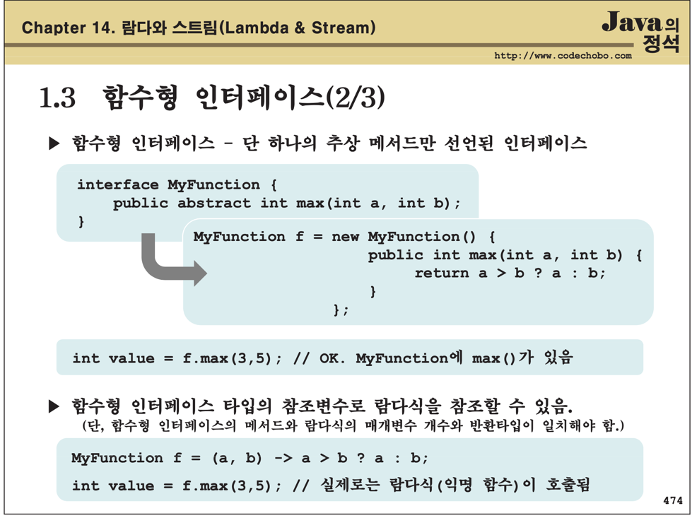
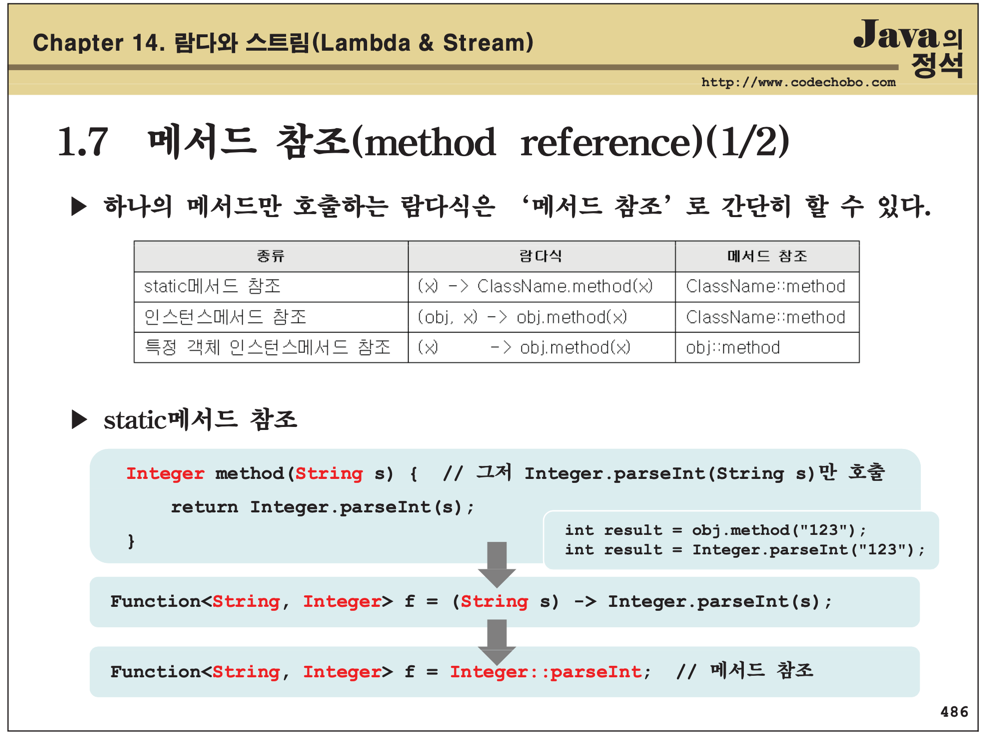

# 14장 람다와 스트림

## 14.1 람다

### 14.1.2 람다식 작성하기
(a,b) -> a > b ? a : b

주의사항
1. 매개변수가 하나인 경우, 괄호() 생략가능(타입이 없을 때만)
2. 블록 안의 문장이 하나뿐 일 때, 괄호{}생략가능(끝에 ';' 안 붙임)
3. 단, 하나뿐인 문장이 return문이면 괄호{} 생략불가

### 14.1.3 함수형 인터페이스
- 함수형 인터페이스: 단 하나의 추상 메서드만 선언된 인터페이스

### 14.1.7 메서드 참조

## 14.2 스트림
### 14.2.1 스트림이란?
- 다양한 데이터 소스를 표준화된 방법으로 다루기 위한 것
- 스트림이 제공하는 기능 - 중간 연산과 최종 연산
  - 중간 연산 - 연산결과가 스트림인 연산, 반복적으로 적용가능
  - 최족 연산 - 연산결과가 스트림이 아닌 연산, 스트림의 요소를 소모하므로 한번만 적용가능

### 14.2.2 스트림의 특징
- 스트림은 데이터 소스로부터 데이터를 일기만할 뿐 변경하지 않는다.
- 스트림은 Iterator처럼 일회욜리다.(필요하면 다시 스트림을 생성해야 함)
- 최종 연산 전까지 중간연산이 수행되지 않는다. - 지연된 연산
- 스트림은 작업을 내부 반복으로 처리한다.
- 스트림의 작업을 병렬로 처리 - 병렬스트림
- 기본형 스트림 - IntStream, LongStream, DoubleStream
  - 오토박싱&언박싱의 비효율이 제거됨(Stream< Interger> 대신 IntStream 사용)
  - 숫자와 관련된 유용한 메서드를 Stream<T>보다 더 많이 제공