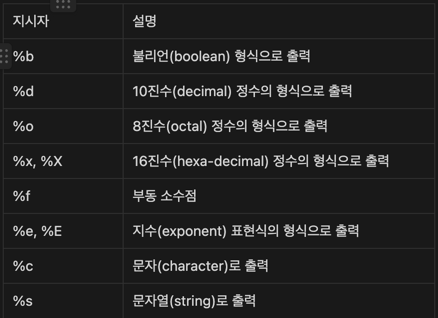

println() -> 출력형식 지정 불가
printf() 로 출력형식 지정 가능

%n -> 줄바꿈

## Scanner - 화면에서 입력받기

1. import문 추가
    - import java.util.*;
2. Scanner 객체 생성
    - Scanner scanner = new Scanner(System.in)
3. Scanner 객체 사용
    - int num = scanner.nextInt(); 
      - 입력받은 정수를 num에 저장
    - String input = scanner.nextLine();
      - 입력받은 내용을 input에 저장
    - int num = Integer.parseInt(input);
      - 문자열(input)을 숫자(num)로 변환

