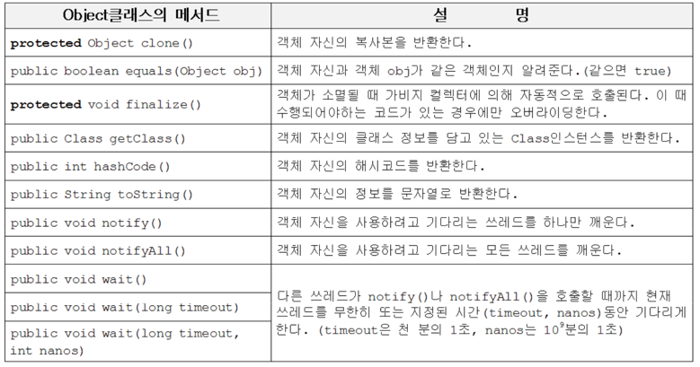
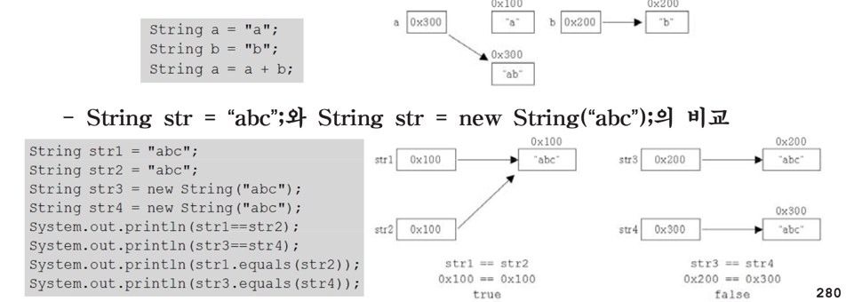
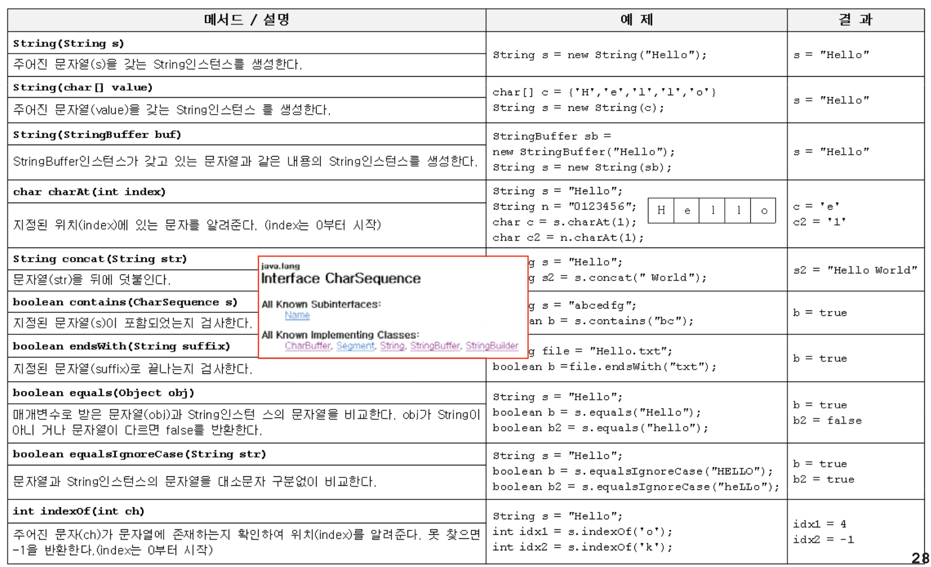
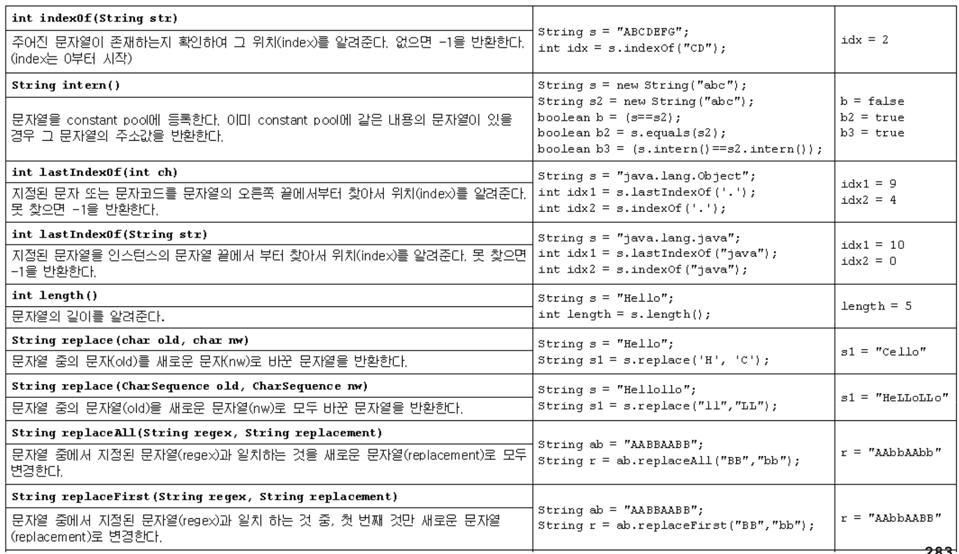
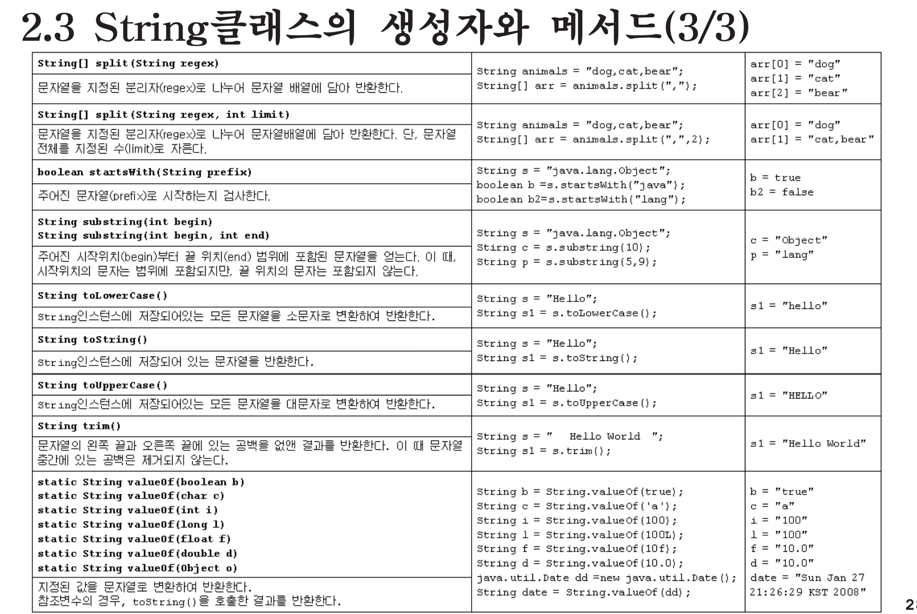

# java.lang 패키지

## 1. Object클래스
### 1.1 Object클래스의 메서드
- 모든 클래스의 최고 조상. 오직 11개의 메서드만 가지고 있다.
- notify(), wait() 등은 쓰레드와 관련된 메서드이다.
- equals(), hashCode(), toString()은 적절히 오버라이딩해야 한다.

### 1.2 equals(Object obj)
- 객체 자신과 주어진 객체(obj)를 비교한다. 같으면 true, 다르면 false.
- Object클래스에 정의된 equals()는 참조변수 값(객체의 주소)을 비교한다.
- equals()를 오버라이딩해서 인스턴스변수의 값을 비교하도록 바꾼다.

### 1.3 hashCode()
- 객체의 해시코드(int타입의 정수)를 반환하는 메서드(해시함수)
다량의 데이터를 저장&검색하는 해싱기법에 사용된다.
- Object클래스의 hashCode()는 객체의 내부주소를 반환한다.
- equals()를 오버라이딩하면, hashCode()도 같이 오버라이딩 해야 한다.
equals()의 결과가 true인 두 객체의 hash code는 같아야 하기 때문
  - System.identityHashCode(Object obj)는 Object클래스의 hashCode()와
동일한 결과를 반환한다.

### 1.4 toString()
객체의 정보를 문자열(String)로 제공할 목적으로 정의된 메서드

### 1.5 getClass()
- 자신이 속한 클래스의 Class객체를 반환하는 메서드
- Class객체는 클래스의 모든 정보를 담고 있으며, 클래스당 단 1개만 존재
- 클래스파일(*.class)이 메모리에 로드될때 생성된다.

## 2. String 클래스
### 2.1 Stirng클래스의 특징
- 문자형 배열(char[])과 그에 관련된 메서드들이 정의되어 있다.
- String인스턴스의 내용은 바꿀 수 없다.(immutable)

### 2.2 빈 문자열
- 내용이 없는 문자열. 크기가 0인 char형 배열을 저장하는 문자열
- 크기가 0인 배열을 생성하는 것은 어느 타입이나 가능
String str = "";

### 2.3 String클래스의 생성자와 메서드

