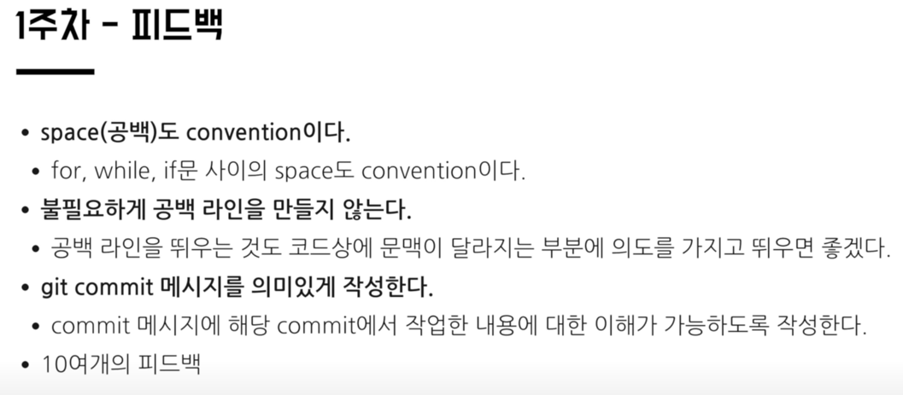
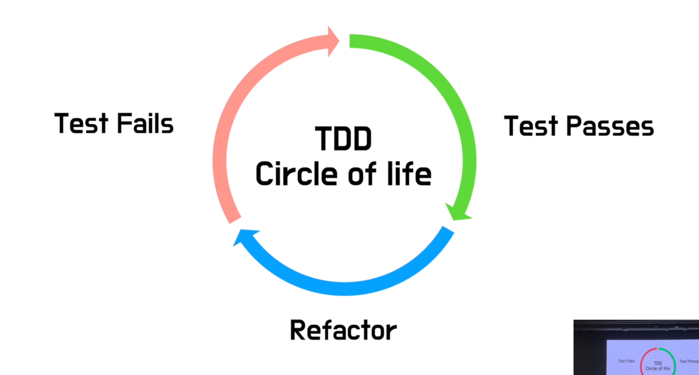

# [우아한테크세미나] 190425 TDD 리팩토링 by 자바지기 박재성님

https://www.youtube.com/watch?v=bIeqAlmNRrA

### 사전지식

---
[TDD와 리팩토링의 중요성](TDD와_리팩토링의_중요성.md)

### 발표내용

---
1. [의식적인 연습이란?](#의식적인-연습)
2. [TDD, 리팩토링 적용 - 개인](#tdd-리펙토링-적용---개인)
3. TDD, 리팩토링 적용 - 개인(주니어) -> 팀
4. TDD, 리팩토링 적용 - 내가 리더

---

## 의식적인 연습
* 1만시간의 재발견(안데르스 에릭슨)

아마추어와 프로를 나누는 결정적인 차이

목적의식 있는 연습 
에 얼마나 많은 시간을 투자했느냐?

의식적인 연습의 7가지 원칙
1. 효과적인 훈련 기법이 수립되어 있는 기술 연마
2. 개인의 **컴포트 존을 벗어난 지점에서 진행, 자신의 현재 능력을 살짝 넘어가는 작업을 지속적으로 시도**
3. **명확하고 구체적인 목표**를 가지고 진행
4. 신중하고 계획적이다. 즉, 개인이 온전히 집중하고 '의식적'으로 행동할 것을 요구
5. **피드백과 피드백에 따른 행동 반경**을 수반
6. 효과적인 심적 표상을 만들어내는 한편으로 심적 표상에 의존
7. **기존에 습득한 기술의 특정 부분을 집중적으로 개선함으로써 발전시키고, 수정**하는 과정을 수반

주차가 반복될수록 제약사항의 난이도가 더 높아짐

## TDD, 리펙토링 적용 - 개인

TDD 전에 단위테스트로 미리 학습할것

알고리즘을 학습한다면 알고리즘 구현에 대한 검증을 단위 테스트로 한다. 
알고리즘은 input과 output이 명확하기 때문에 연습하기 좋다.
 -> TDD 연습이 목적이므로 난이도가 낮거나 자신에게 익숙한 문제로 시작
 -> 웹, 모바일 UI나 DB에 의존관계를 가지지 않는 요구사항으로 연습한다.

TDD 사이클

- 리팩토링을 안 하는 경우가 많다.

메서드 분리
클래스 분리
의존관계 추가를 통한 난이도 높이기

[객체지향 생활체조 원칙](../../../../OOP/이유와_솔루션으로_정리하는_객체지향_생활체조_원칙.md)

작은 성공을 계속 쌓아서 큰 성공을 이룩하기

실패해도 괜찮다.
실패하기 전보다 나는 한 단계 성장한다.
좋은 회사는 실패해도 같이 도전하는 사람을 원한다.
실패의 책임을 묻는다면 그만둔다.
